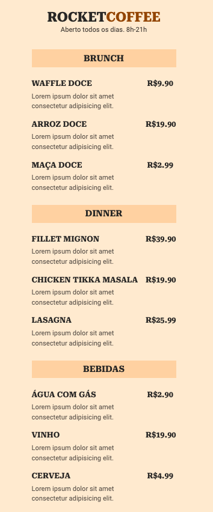

# Maratona Explorer 3.0

## Overview

This Project was an assignment from [Rocketseat](https://www.rocketseat.com.br/). We were instructed to build a website with a restaurant menu and its QR code.

## Table of Contents

- [Description](#description)
- [Deployed Application](#deployed-application)
- [QR Code](#qr-code)
- [Contributing](#contributing)
- [Questions](#questions)

## Description

This Application was created with only HTML and CSS.
The content of this application is fake and made for demonstration purposes only.

## Deployed Application

[RocketCoffee](https://idyllic-pika-f56ccc.netlify.app/)

## QR Code

## Contributing

Isaaccna

## Questions

For any questions about the project, please visit my:  
 GitHub Profile: [isaaccna](https://github.com/isaaccna)  
 or  
 Email: @ isaac.andrade1231@gmail.com
